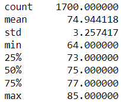
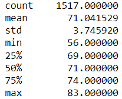
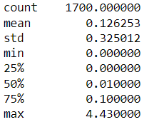
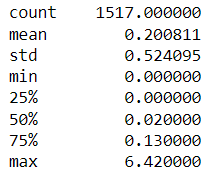
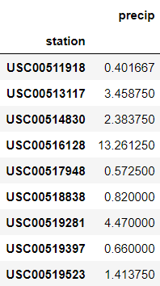
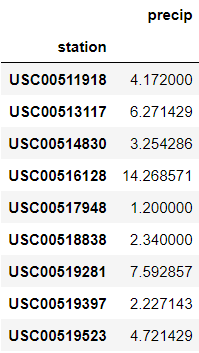

# surfs_up

## Overview

This analysis examines weather patterns in Hawaii in order to determine the climate's suitability for a proposed surf/ice cream shop. Specifically, it compares temperature and precipitation measurments in June and December to get an idea of whether temperatures at both ends of the year are suitable to such an enterprise. While a number of factors other than weather might contribute to this determination, they are not included within the scope of this analysis.

## Results

Temperatures in Hawaii appear remarkably stable:
* The difference in mean temperature is only around 4 degrees (71.0 degrees in December vs. 74.9 degrees in June)
* Minimum temperatures recorded are a still similar, but a little more widely spaced. In both months, the minimum recorded temperature is likely too cold for strong surfing rentals or ice cream sales (56.0 in December and 64.0 in June)
* Maximum temperatures are the most similar of all, with only a two degree difference between December (83) and June (85) -- ideal weather for ice cream and water sports.

|June Temperature Stats|December Temperature Stats|
|---|---|
|||

## Summary

Hawaii certainly seems warm enough year round to support a combined surf and ice cream shop, and such minor seasonal fluctuations in temperature  are unlikely, on their own, to result in a strong seasonal ebb and flow to business. However, temperature is not the only environmental factor likely to influence surf equipment rentals and ice cream sales. Some parts of Hawaii can be very wet, as seen below from the daily precipitation statistics recorded at a handful of weather stations. While the average rainfall for a single day was .126" in June and .201" in December, two locations recorded over 4" of rain in a single day in June, and one recorded nearly 6.5" in a single day in December!
|June Precipitation Stats|December Precipitation Stats|
|---|---|
||

Such days are outliers, however, so the total monthly rainfall, averaged across the years in the dataset, may prove more illuminating:
|Avg. June Precipitation Totals|Avg. December Precipitation Totals|
|---|---|
||

While there is significant variance between the rainfall recorded at each station, it's clear that December is a much wetter month. Since rain is likely to result in decreased business, these measurements should be taken into account when determining whether the proposed shop will be sustainable venture year-round.
